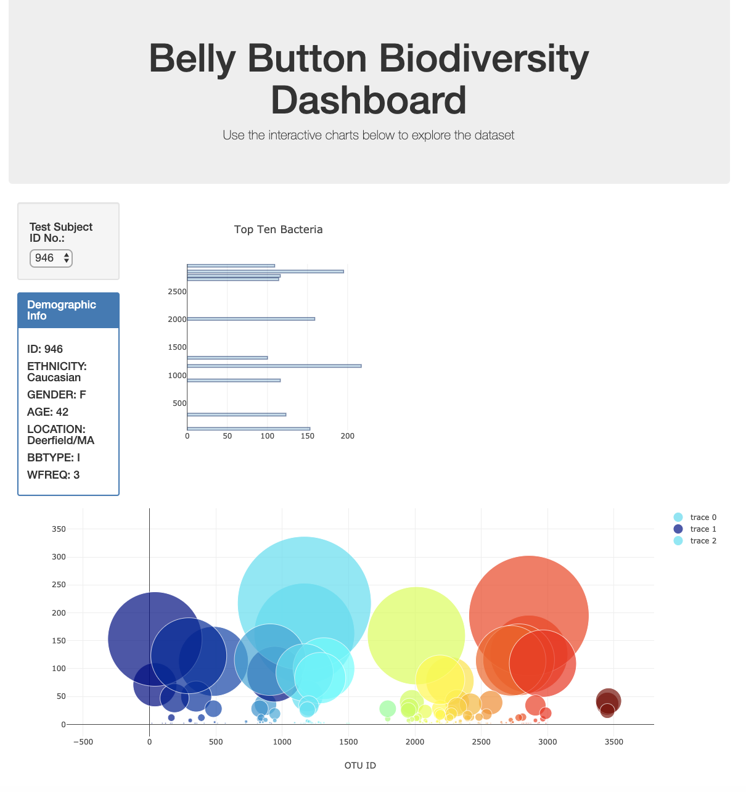

# Belly_Button_Diversity

### This Project shows the following:
 - A horizontal bar chart of the top ten bacterial species in a volunteer’s navel
 - A bubble chart that visualizes the relative frequency of all the bacterial species found in a volunteer’s navel
 - Volunteer's demographic panel

